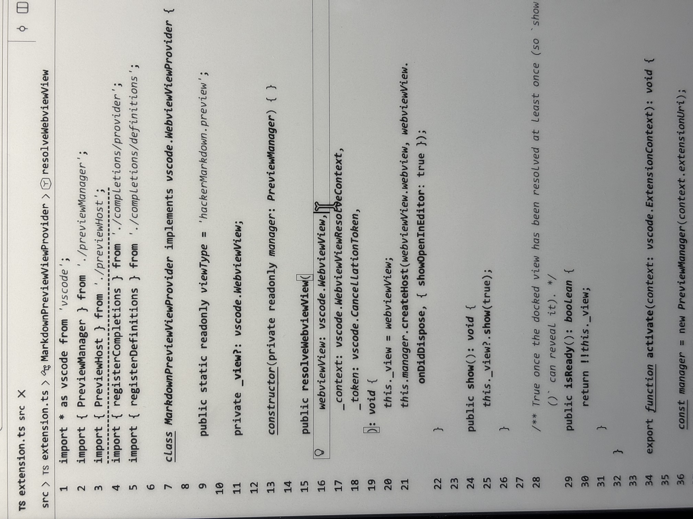
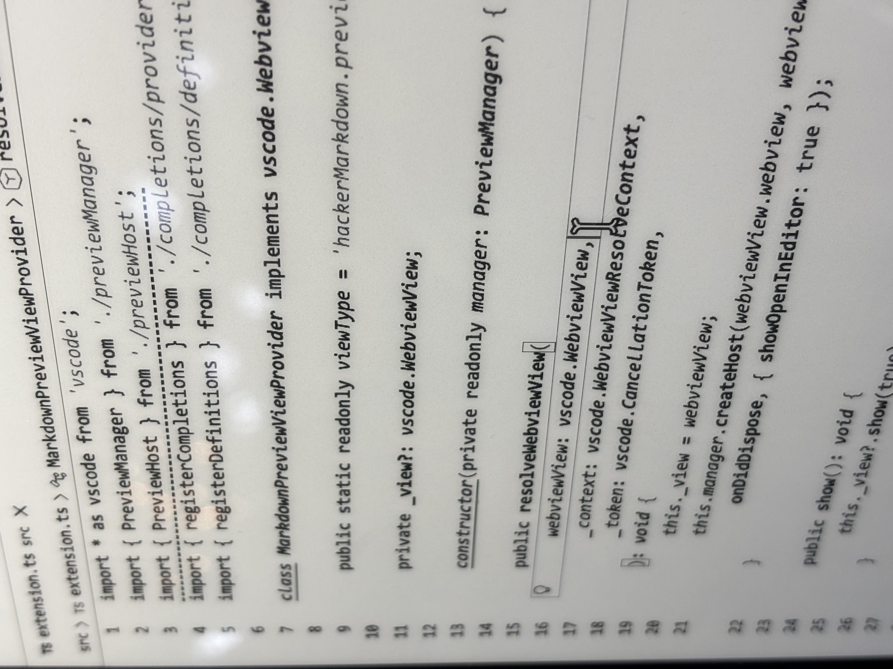

# EINK 60HZ Theme

A VS Code dark theme based on **Dark High Contrast**, enhanced with **font-style differentiation** for grayscale/e-ink readability — with colors specifically fine-tuned for high contrast on e-ink.

> ⚠️ **Warning:** the colors are tuned for e-ink, so they are desaturated and washed out on a normal monitor. If you mainly work on a regular monitor, this theme will look bad — use a different theme instead.

---

## Screenshots





---

## The Problem

E-ink monitors are grayscale. Traditional syntax highlighting relies entirely on color to distinguish code elements. On a grayscale display, colors collapse into near-identical gray levels, making code hard to scan.

Most e-ink setups use ICC color inversion (black ↔ white) for readability, but this doesn't solve the fundamental problem: **color is the only dimension of differentiation.**

## The Solution: Font Style as a Semantic Dimension

This theme layers **font styles** on top of the standard Dark High Contrast colors:

| Font Style | Code Elements | Rationale |
|---|---|---|
| **bold** | keywords, functions, storage types/modifiers, constants, tags, preprocessor, escape chars | Structural bone of code — must stand out |
| *italic* | comments, strings, parameters, attributes, regex | Contextual/secondary — visually distinct but not dominant |
| **bold italic** | types, classes, interfaces, enums, structs, namespaces, `this`/`super`/`self` | Declarations needing maximum distinction from functions |
| ~~strikethrough~~ | invalid, deprecated tokens, diff-deleted | Clear "don't use" signal |
| underline | diff-inserted, markup headings | Boundary/clarity signals |
| normal | variables, operators, numbers, punctuation | Baseline — no decoration needed |

On a normal monitor, these styles reinforce the color signal. On a grayscale e-ink, they become the *primary* signal — each code element has a unique typographic identity regardless of shade.

### Why Not Just Grayscale?

The theme keeps the **Dark High Contrast color palette** as its base, but the colors are **desaturated and fine-tuned for maximum contrast on e-ink** — not for color monitors. Expect them to look dull, washed out, and muddy on a regular screen.

- **E-ink, with or without inversion** — font styles as primary signal, colors tuned for high contrast here

### Semantic Token Coverage

The theme includes `semanticTokenColors` rules so TypeScript, JavaScript, Java, and other language-server-backed languages get the same font-style treatment at the semantic level — covering types like `class`, `interface`, `enum`, `function`, `method`, `parameter`, and modifiers like `*.declaration`, `*.static`, `*.readonly`, `*.deprecated`.

---

## Implementation Note: `uiTheme`

The dark variant (`themes/eink_60hz_dark.json`) declares `"uiTheme": "hc-black"` and the light variant (`themes/eink_60hz_light.json`) declares `"uiTheme": "hc-light"` — not `"vs-dark"`. This tells VS Code to use the built-in high-contrast UI base for all chrome (status bar, activity bar, sidebar, tabs, panels, menus, etc.). The theme file itself only defines editor-area colors (background, selection, etc.) — everything else is inherited from the high-contrast base.

### Light Variant

`themes/eink_60hz_light.json` is the exact **color inversion** of the dark theme (every RGB channel flipped, alpha preserved), generated by `local/invert_theme.py`. This is deliberate:

- On e-ink, the grayscale rendering is identical to the dark theme — same luminance levels, just inverted — so readability is unchanged and you can pick whichever polarity suits your room lighting
- The same font-style differentiation applies everywhere

Regenerate it after tuning the dark theme:

```sh
python3 local/invert_theme.py themes/eink_60hz_dark.json themes/eink_60hz_light.json "Eink 60Hz (Light)"
```

---

## Design Principles

1. **Hierarchy over decoration** — every font style maps to a semantic category; nothing is arbitrarily bold or italic
2. **Pure black or pure white background** — the dark variant uses `#000000`, the light variant `#ffffff`; maximum contrast either way
3. **Minimal font-style combinations** — only 5 styles (bold, italic, bold+italic, strikethrough, underline) to avoid confusion
4. **Consistency across languages** — broad TextMate scope lists ensure Python, JS/TS, Java, C++, CSS, and others all benefit

---

## Standalone TextMate Rules

Don't want the full theme? The font-style rules are also available standalone in `text-mate-rules/eink_60hz_text.json` — paste them into `editor.tokenColorCustomizations` in your `settings.json` to get the font-style treatment on any theme:

```json
{
  "editor.tokenColorCustomizations": {
    "textMateRules": [
      {
        ...
      }
    ]
  }
}
```

The full rule set in `text-mate-rules/eink_60hz_text.json` is larger — copy its `editor.tokenColorCustomizations` block into your `settings.json` as-is.

Or merge them automatically (backs up `settings.json` to `.bak` first):

```sh
python3 local/merge_config.py text-mate-rules/eink_60hz_text.json
```

Requires `json5` and `deepmerge`: `pip install json5 deepmerge`

---

## Usage

1. Install the extension from VS Code Marketplace
2. Select **Eink 60Hz (Dark)** or **Eink 60Hz (Light)** from the theme picker (`Preferences: Color Theme`)
3. Works immediately on both e-ink and grayscale monitors; pick the polarity that suits your room lighting

> **On a normal monitor?** The desaturated colors make this theme unpleasant to use. Stick to Dark+, Dark High Contrast, or any other standard theme for day-to-day work on a regular screen.

---

Based on the original [Dark+ Contrast theme](https://github.com/k3a/theme-darkplus-contrast) by k3a.
